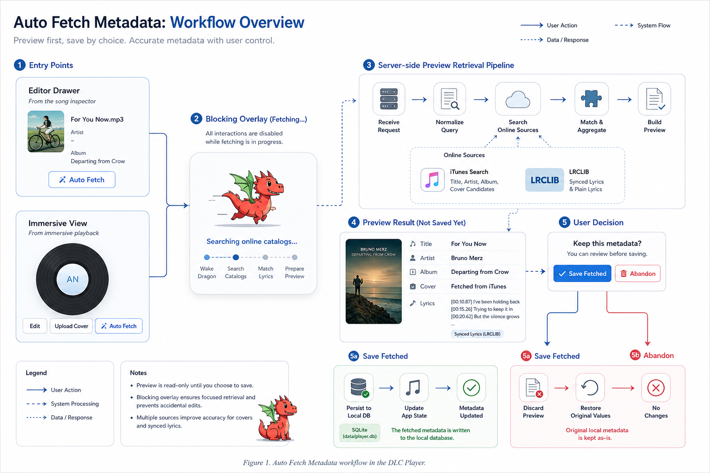

# 78DLC Player

Local web music player for the files in this project's `source/` folder.

It scans the folder, lists your MP3 and MP4 files, plays them in the browser, and stores editable song metadata in a small local SQLite database.

## Features

- Scans `source/` and uses the file name as the initial displayed song name
- Plays local audio and video files through a bottom player bar
- Left sidebar with:
  - `Special Select`
  - `Recent Played`
  - `My Lists`
- Song detail editor for:
  - display name
  - file name
  - artist
  - album
  - notes
  - lyrics
- Cover upload and removal
- Playlist creation and song assignment
- Recent play history
- Auto Fetch metadata preview:
  - searches online sources for title, artist, album, cover art, and synced lyrics
  - shows the fetched result as a preview before saving
  - lets you `Save Fetched` or `Abandon` if the match is wrong
- Auto Fetch is available in both the editor drawer and immersive playback view
- Blocking fetch overlay with a running dragon loader and live stage text during metadata retrieval
- Local metadata DB stored at `data/player.db`

## Requirements

- Node.js 24 or newer

This app uses built-in Node modules only. No `npm install` step is required for the current version.

## Start The App

From this folder:

```bash
node server.js
```

Then open:

`http://localhost:4318`

On macOS, you can also double-click `start.command`.

On Windows, you can double-click `start.bat`.

If your Node install includes npm, `npm start` also works.

## Music Source

- Shared music folder: https://drive.google.com/drive/folders/1BafAOZrEUhHe2PwrG5n1KhEaS1pF6TOg?usp=sharing

## Restore Local Metadata

If you have an old `player.db`, you can restore local song metadata such as lyrics, notes, artists, and cover references into the current database:

```bash
npm run import:metadata -- /path/to/old/player.db /path/to/old/covers
```

The import matches songs by file name and only fills empty fields in the current database.

## Auto Fetch Metadata

The app includes an online metadata retrieval flow for songs that still have incomplete local information.



What it does:

- Tries to match the selected song against online catalog data
- Pulls candidate values for:
  - display title
  - artist
  - album
  - cover art
  - synced lyrics when available
- Shows the fetched result as a temporary preview first
- Requires an explicit save step before the database is updated

How the workflow behaves:

1. Click `Auto Fetch` from either the editor drawer or immersive playback view.
2. A blocking loading overlay appears with the dragon animation and stage text so the current fetch cannot be interrupted by accidental edits.
3. The app requests a preview from the server instead of saving immediately.
4. If a usable match is found, the UI shows the fetched metadata as a temporary preview.
5. You can then choose:
   - `Save Fetched` to write the fetched values into `data/player.db`
   - `Abandon` to discard the fetched result and restore the original local values

Current online sources:

- iTunes Search for title, artist, album, and cover candidates
- LRCLIB for plain lyrics and synced timestamped lyrics

This preview-first workflow is intentionally conservative so incorrect matches can be rejected before they touch your local metadata.

## Notes

- Source media is read from `source/`
- Song metadata and playlists are stored in `data/player.db`
- Uploaded cover images are stored in `data/covers/`
- If you rename a song inside the app, the real file in `source/` is renamed too
- New files dropped into `source/` can be picked up by refreshing the page or clicking `Rescan Source`

## Project Structure

```text
78DLCPlayer/
|-- data/
|   |-- covers/
|   `-- player.db
|-- public/
|   |-- app.js
|   |-- index.html
|   `-- styles.css
|-- source/
|-- package.json
|-- README.md
`-- server.js
```
